## Deep Dive Architecture Document: 65‑Domain Distributed Platform

This document presents a complete reference architecture for a modern cloud‑native platform that spans 65 capability domains, covering traditional microservices, AI agents, content processing, business orchestration, and full lifecycle management. The architecture is organised into seven logical layers, each of which can be built and evolved independently. Diagrams are provided in both textual (Mermaid) and descriptive form to aid understanding.

---

### 1. High‑Level Seven‑Layer Architecture

The platform is partitioned into the following layers, from the public internet down to foundational infrastructure:

1. **Global & Edge Traffic Management** – Global DNS, DDoS protection, perimeter firewalls, edge TLS termination, reverse proxies.  
2. **Experience Delivery & Frontend Platform** – UI backends (BFF, SSR, WebSocket), mobile distribution, design systems, feature flags, internationalisation, voice channels.  
3. **API & Integration Gateway** – API management, developer portals, tool integration (MCP), service catalogues, message transformation.  
4. **Application & Agent Core** – Business microservices, AI agents, A2A communication, content processing engines, digital twins, scheduling.  
5. **Application‑Adjacent Runtimes & Platform Services** – Service mesh, business process engine, knowledge & analytics, search, notifications, MLOps, synthetic data, quantum‑safe crypto.  
6. **Persistence, State & Data Pipeline Infrastructure** – All persistent stores, caching, event streaming, CDC/ETL, backup, archival, schema migrations.  
7. **Foundation & Governance Infrastructure** – Container orchestration, service discovery, secrets, CI/CD, IaC, IAM, compliance, cost management, observability, security, sustainability.

Each layer is described in detail below, accompanied by a dedicated architecture diagram.

---

### 2. Layer 1 – Global & Edge Traffic Management

This layer is the first point of contact for all external traffic. It steers users to the closest healthy region, protects against attacks, and terminates TLS before forwarding to the API gateway or static asset servers.

**Key components & tools (with domain mapping):**
- Global DNS / Latency‑based routing → **Route 53, Cloudflare Load Balancing** (Domain 15)
- DDoS Protection → **Cloudflare, AWS Shield** (Domain 57)
- Perimeter Firewall → **Palo Alto, AWS Network Firewall** (Domain 57)
- Edge Reverse Proxy / TLS offload → **Nginx, HAProxy, Envoy** (Domain 15)
- Multi‑cloud infrastructure abstraction → **Terraform, Crossplane** (Domain 64)

**Diagram – Layer 1: Global & Edge Traffic Management**

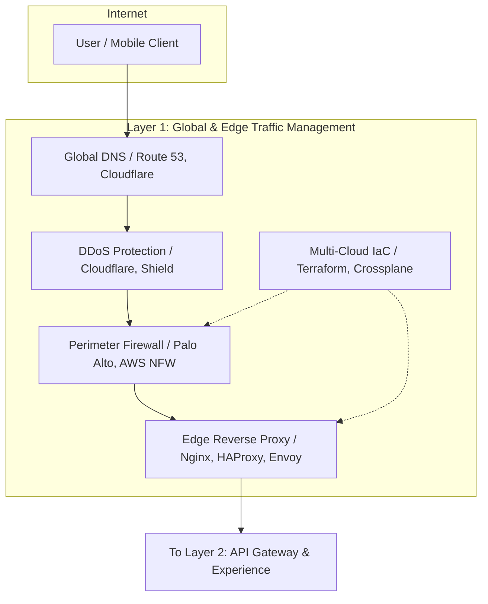

*Description:* Incoming requests are routed via global DNS (Route 53/Cloudflare) through DDoS mitigation (Cloudflare/Shield) and a perimeter firewall (Palo Alto/AWS Network Firewall). The edge reverse proxy (Nginx/HAProxy) terminates TLS and forwards traffic to the API Gateway (Layer 3) or static asset servers. Infrastructure across clouds is provisioned using Terraform or Crossplane (Domain 64), which can also manage the firewall and load balancer configurations.

---

### 3. Layer 2 – Experience Delivery & Frontend Platform

This layer is responsible for serving user‑facing applications, both web and mobile. It includes the UI backend (BFF) with server‑side rendering, real‑time push, feature flagging, internationalisation, mobile app distribution, and voice/conversational interfaces.

**Key components & tools:**
- UI Backend / BFF → **Next.js, Remix** (Domain 14)
- WebSocket real‑time → **Socket.IO** (Domain 14)
- Monorepo & shared code → **Nx, Turborepo** (Domain 14)
- Design system & component library → **Storybook, Figma, Style Dictionary** (Domain 14)
- Schema‑driven forms → **Alibaba Formily** (Domain 14)
- Feature flags & A/B testing → **LaunchDarkly, Unleash** (Domain 41)
- Internationalisation → **Crowdin, Lokalise** (Domain 38)
- Mobile App Distribution & MDM → **Microsoft Intune, Jamf, TestFlight** (Domain 50)
- Voice & Conversational Channels → **Twilio, Amazon Connect** (Domain 51)
- Licensing & entitlement → **Stripe Billing, Orb** (Domain 39) – used here for feature access decisions

**Diagram – Layer 2: Experience Delivery & Frontend Platform**

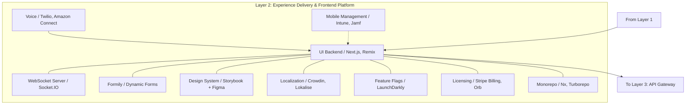

*Description:* The UI Backend (Next.js/Remix) runs SSR, BFF API routes, and serves static assets. It uses Socket.IO for real‑time updates. All frontend code lives in a monorepo (Nx/Turborepo) with a shared design system (Storybook+Figma). Forms are generated by Formily. Feature flags (LaunchDarkly) control rollout, and i18n is managed via Crowdin/Lokalise. Mobile apps are distributed via TestFlight/Intune. Voice calls from Twilio are handled by the BFF. Licensing decisions (Stripe) are enforced here.

---

### 4. Layer 3 – API & Integration Gateway

This layer provides a unified entry point for all API consumers, internal and external. It manages API lifecycle, developer portals, and – critically – the tool integration abstraction via MCP servers, making any capability accessible to AI agents or processes through a governed interface.

**Key components & tools:**
- API Gateway → **Kong, Envoy** (Domain 5)
- Developer Portal & API Catalogue → **Backstage, Apigee API Hub** (Domain 48)
- API Lifecycle Management → **Spectral, Stoplight** (Domain 28)
- Tool Integration & Abstraction → **MCP Servers** (Domain 19), **Apache Camel** (Domain 53)
- Message Transformation → **Kafka Connect, custom transforms** (Domain 53)
- Service Catalogue → **Backstage** (Domain 48) – overlaps, also in developer experience

**Diagram – Layer 3: API & Integration Gateway**

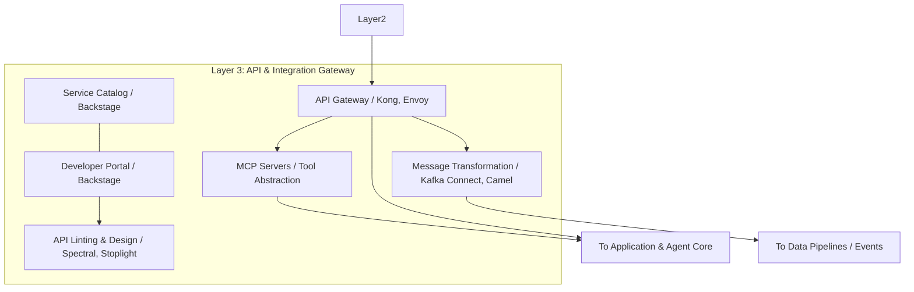

*Description:* Kong (or Envoy) serves as the north‑south API gateway, handling auth, rate limiting, and routing. API design is governed by Spectral and published in Backstage. Tool abstraction is implemented via MCP servers registered behind the gateway; they expose internal services (e.g., databases, legacy systems) as standard tools. Message transformation adapters (Kafka Connect) run here to convert between canonical and service‑specific schemas.

---

### 5. Layer 4 – Application & Agent Core

This is where the business logic lives – microservices, AI agents, multi‑agent collaboration, content processing, digital twins, and scheduled jobs. All inter‑service and agent‑to‑agent communication happens through the event backbone (Kafka/NATS) using well‑defined envelopes.

**Key components & tools:**
- Business Microservices → polyglot (Domain 3)
- AI Agents → custom workers (LangChain or direct LLM calls) (Domain 13)
- A2A Communication → Kafka/NATS + standard envelopes (Domain 13, 9)
- Agent Memory (short/long) → Redis + Qdrant/pgvector (Domain 13, 7, 16)
- Multi‑agent strategies (debate, hierarchical) → AutoGen / LangGraph / custom (Domain 13)
- Skills Engine → Semantic Kernel / LangChain tools / MCP (Domain 13, 19)
- Content Processing Engine → **Custom canonical model engine** (or Pandoc, Tika) (Domain 20)
- Digital Twins → Azure Digital Twins, Eclipse Ditto (Domain 35)
- Scheduling & Cron → **Kubernetes CronJobs, Temporal, Airflow** (Domain 36)
- Blockchain / Distributed Ledger → Hyperledger Fabric (Domain 44, optional)
- External Integration → Southbound adapters (Domain 6) → often via MCP servers

**Diagram – Layer 4: Application & Agent Core**

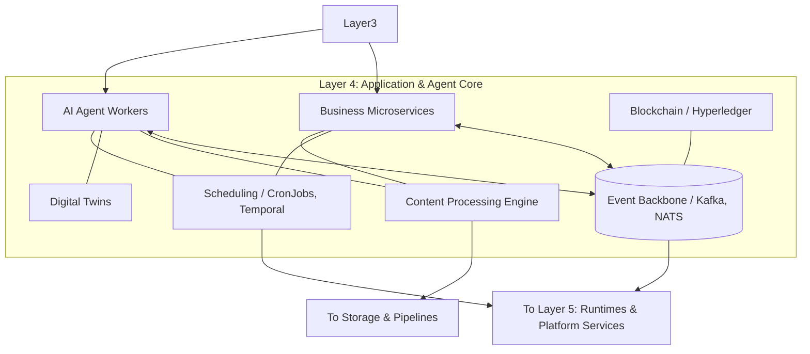

*Description:* Business microservices and AI agents run as containerised workloads. They communicate asynchronously through the event backbone (Kafka/NATS). Agents use MCP clients to invoke tools. The content processing engine ingests documents, chunks them, and produces embeddings; it can be called synchronously or via events. Digital twins mirror physical assets and interact via the event bus. Scheduled jobs (Temporal/CronJobs) trigger periodic processing. Optional blockchain services write immutable audit trails.

---

### 6. Layer 5 – Application‑Adjacent Runtimes & Platform Services

This layer contains sidecars and dedicated services that provide cross‑cutting non‑functional capabilities: service mesh, business process orchestration, knowledge & analytics, search, notifications, MLOps, synthetic data generation, and quantum‑safe crypto.

**Key components & tools:**
- Service Mesh → **Linkerd, Istio** (Domain 4)
- Business Process Engine → **Our Process Engine** (Camunda, Flowable, custom) (Domain 17)
- Knowledge & Analytics → **Grafana, Superset, MLflow, LangSmith** (Domain 18)
- Full‑Text Search → **Elasticsearch, OpenSearch** (Domain 40)
- Notifications → **Novu, Courier** (Domain 37)
- MLOps / LLMOps → **MLflow, Weights & Biases, LangSmith** (Domain 42)
- Synthetic Data Generation → **Gretel, Tonic** (Domain 43)
- Quantum‑Safe Crypto → **OpenQuantumSafe, AWS KMS PQ** (Domain 45)
- Data Quality & Governance → **Great Expectations** (Domain 47) – also in foundation, but quality rules may run here
- Circuit Breakers / Resilience → handled by mesh and libraries (Domain 32)

**Diagram – Layer 5: Runtimes & Platform Services**

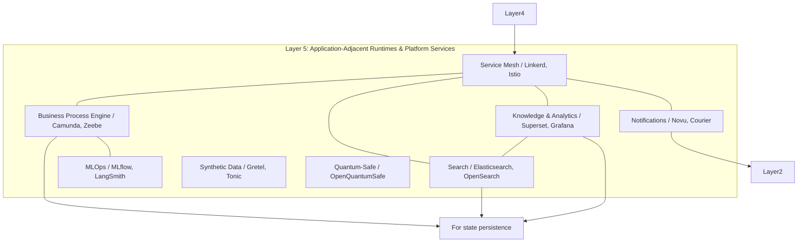

*Description:* The service mesh (Linkerd/Istio) provides automatic mTLS, retries, and circuit breakers for all east‑west traffic. The business process engine runs long‑running workflows and human tasks; it integrates with the event backbone and agent workers. Knowledge & analytics services run BI dashboards, process mining, and RAG pipelines. Full‑text search indexes are kept in sync via CDC. Notifications are dispatched through Novu/Courier. MLOps tracks experiments, and synthetic data is generated for testing. Quantum‑safe libraries are available for cryptographic agility.

---

### 7. Layer 6 – Persistence, State & Data Pipeline Infrastructure

This layer includes all persistent storage engines, caching, event streaming, CDC/ETL pipelines, backup/recovery, and archival systems.

**Key components & tools:**
- Relational DB → **PostgreSQL, CockroachDB** (Domain 16)
- Document DB → **MongoDB** (Domain 16)
- Graph DB → **Neo4j** (Domain 16)
- Vector DB → **Qdrant, pgvector** (Domain 16)
- Time‑series → **InfluxDB, TimescaleDB** (Domain 16)
- Object/File Storage → **MinIO, S3** (Domain 16)
- Key‑value / Cache → **Redis** (Domain 7)
- Event Streaming / Log → **Kafka, NATS** (Domain 9) – shared with layer 4, but physically in this layer
- CDC & ETL → **Debezium, dbt, Airflow** (Domain 34)
- Session Replication → **Redis Cluster, Hazelcast** (Domain 49)
- Block Storage / NFS → **Rook/Ceph, Longhorn, EBS** (Domain 52)
- Backup & DR → **Velero, Kasten** (Domain 27)
- Schema Migration → **Flyway, Liquibase** (Domain 60)
- Data Archival → **S3 Glacier, Azure Archive** (Domain 61)
- Document Lifecycle / Records → **Alfresco, S3 Object Lock** (Domain 55)

**Diagram – Layer 6: Persistence & Data Pipelines**

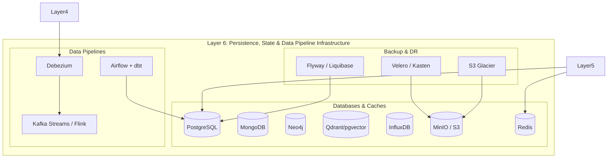

*Description:* The persistence layer hosts polyglot storage: PostgreSQL for relational and vector needs, MongoDB for documents, Neo4j for graphs, InfluxDB for metrics, Redis for caching and sessions, and S3/MinIO for objects. CDC (Debezium) captures changes and feeds them to stream processors or analytics. Data pipelines (Airflow + dbt) transform data in the warehouse. Backup (Velero) and archiving (Glacier) ensure durability. Schema migrations are managed by Flyway/Liquibase.

---

### 8. Layer 7 – Foundation & Governance Infrastructure

This bottom layer provides the container orchestration, service discovery, secrets, CI/CD, IaC, IAM, compliance, cost management, observability, security operations, and more. It is the “platform” upon which all higher layers are built.

**Key components & tools (a selection of the 25+ domains in this layer):**
- Container Orchestration → **Kubernetes** (Domain 1)
- Service Discovery & Registry → **Consul** (Domain 2)
- Configuration & Secrets → **Consul KV, Vault** (Domain 8)
- Identity & Access Management → **Keycloak, Ory, OPA** (Domain 24)
- Compliance & Audit → **OPA/Gatekeeper, Vanta, Drata** (Domain 25)
- Cost Management / FinOps → **Kubecost, InfraCost** (Domain 26)
- Multi‑tenancy → **Kong + PostgreSQL RLS** (Domain 29)
- Edge / IoT → **K3s, WasmEdge** (Domain 30)
- Versioning & Compatibility → **Schema Registry** (Domain 31)
- High Availability → **etcd, resilience4j** (Domain 32)
- Data Privacy → **Google Cloud DLP, Vault Transform** (Domain 33)
- CI/CD & Progressive Delivery → **GitHub Actions, Argo CD, Argo Rollouts** (Domain 22)
- Testing & QA → **k6, Playwright, Pact** (Domain 23)
- Developer Experience → **Backstage, Crossplane** (Domain 21)
- Infrastructure as Code → **Terraform, Pulumi** (Domain 58)
- Environment Management → **Argo CD app sets** (Domain 59)
- Observability → **OpenTelemetry, Grafana LGTM** (Domain 11)
- Security Operations → **Splunk, Velociraptor** (Domain 62)
- Sustainability → **Cloud Carbon Footprint, Kepler** (Domain 63)
- Data Masking → **Tonic, Delphix** (Domain 65)
- HSM & Key Management → **AWS CloudHSM, Vault** (Domain 56)
- Incident Response → **PagerDuty, TheHive** (Domain 62)
- Network Policy → **Calico, Cilium** (Domain 57)
- Time Sync → **chrony, AWS Time Sync** (Domain 54)

**Diagram – Layer 7: Foundation & Governance**

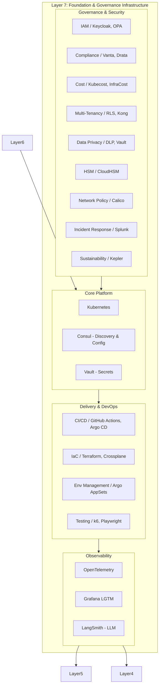

*Description:* The foundation layer provides Kubernetes as the container orchestrator, with Consul for service discovery and agent registry, and Vault for dynamic secrets. Delivery pipelines (GitHub Actions + Argo CD) deploy to ephemeral and permanent environments. IaC tools provision cloud resources. Governance controls enforce IAM (Keycloak/OPA), compliance (Vanta), cost (Kubecost), and privacy (DLP). Observability (OpenTelemetry, Grafana, LangSmith) collects signals from all layers. Security operations (Splunk) monitor for incidents.

---

### 9. End‑to‑End Architecture – Aggregated View

The following diagram shows how the seven layers interconnect, with major data flows highlighted.

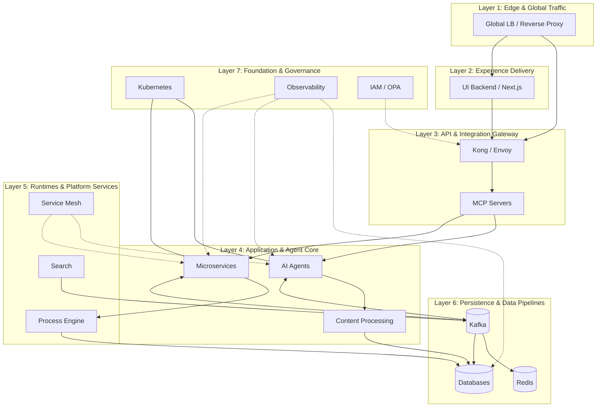

*Description:* External traffic enters through the global load balancer and reaches the API gateway or UI backend. The gateway routes to MCP servers for tool access, and to microservices/agents directly. Agents and services communicate asynchronously via Kafka. The process engine coordinates long‑running tasks. The service mesh secures east‑west traffic. Observability collects from all layers, and IAM policies are enforced at the gateway.

---

### 10. Conclusion

This architecture document provides a complete, layered blueprint for a distributed platform covering all 65 capability domains. Every component, whether a cloud service, an open‑source tool, or a custom service, has a clear place within the seven layers. The decoupled design allows teams to select, replace, or scale each component independently, while the diagrams ensure that the full system remains comprehensible.
---

## Deep‑Dive Architecture: Complete Platform Partitioned View

The following sections break the platform into manageable, well‑defined subsystems. Every diagram focuses on a specific capability or a tight group of related capabilities, making each diagram easily readable while together they form the full picture.

---

### 1. Layer 1 – Global & Edge Traffic Management

**Overview**  
This layer handles all external traffic before it reaches any application component – global DNS steering, DDoS mitigation, perimeter firewalls, and edge TLS termination.

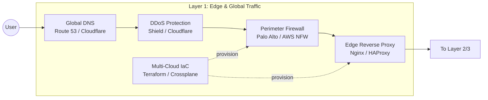

**Key Components & Mapping**
- **Domain 15 – Load Balancing & Traffic Routing:** Global DNS, edge L7 reverse proxy, consistent hashing algorithms.
- **Domain 57 – Network Policy & External Firewall:** Perimeter firewalls, DDoS protection, VPN gateways.
- **Domain 64 – Vendor Abstraction & Multi‑Cloud:** IaC tools provisioning network resources across clouds.

**Interaction**
1. DNS resolves to the nearest edge location.
2. DDoS scrubs volumetric attacks.
3. Perimeter firewall applies IP/port filtering.
4. Edge reverse proxy terminates TLS and forwards to the API gateway or static asset servers.

---

### 2. Layer 2 – Experience Delivery & Frontend Platform

**Overview**  
This layer delivers web and mobile frontends, supports real‑time interactions, manages feature flags, localisation, and voice channels.

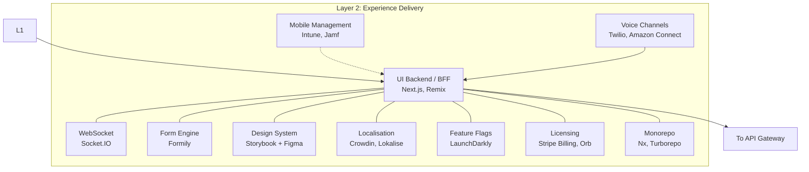

**Domains Covered**
- Domain 14 – UI Backend & Frontend Platform (BFF, SSR, static serving, design systems, monorepo, form builders).
- Domain 38 – Localization & i18n.
- Domain 39 – Licensing & Entitlement (feature flags also used for entitlements).
- Domain 41 – A/B Testing & Feature Flagging.
- Domain 50 – Mobile Device Management & App Distribution.
- Domain 51 – Voice & Conversational Channels.

**Key Flows**
- BFF serves SSR pages and aggregates data from internal microservices via the API gateway.
- WebSocket server pushes real‑time updates from the event backbone.
- Feature flags toggle UI elements without redeployment.
- Mobile apps are distributed via MDM and connect to the same BFF.

---

### 3. Layer 3 – API & Integration Gateway

**Overview**  
Central API management, authentication, tool integration abstraction (MCP), service catalogues, and message transformation.

#### 3.1 API Gateway & Tool Integration

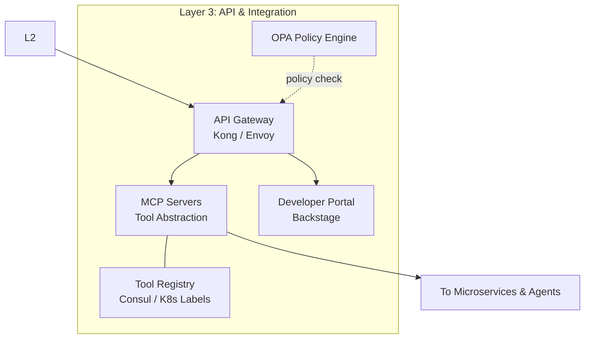

**Domains Covered**
- Domain 5 – Northbound Exposure (API Gateway).
- Domain 19 – Tool Integration & Abstraction (MCP servers, tool registry).
- Domain 28 – API Lifecycle Management (design, documentation, versioning).
- Domain 48 – Service Catalog & Marketplace.

**Interaction**
1. API Gateway authenticates users/agents (JWT/OAuth2) and enforces rate limits.
2. MCP servers expose internal capabilities as standard tools; they are discovered via a registry (Consul KV or K8s labels).
3. OPA evaluates fine‑grained policies: “agent X can call tool Y on resource Z”.

#### 3.2 Message Transformation & Canonical Models

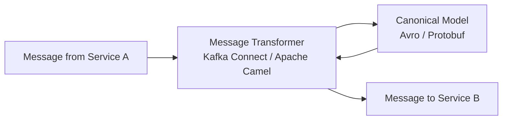

**Domain 53 – Message Transformation & Canonical Models.**  
Transformers convert between service‑specific schemas and a shared canonical model, deployed as Kafka Connect connectors or Camel routes.

---

### 4. Layer 4 – Application & Agent Core

This layer contains business microservices, AI agents, multi‑agent orchestration, content processing, digital twins, scheduled jobs, and optional blockchain.

#### 4.1 Agentic Systems – MCP Tool Layer Deep‑Dive

**Goal**: Every enterprise capability (database, API, legacy system) becomes a discoverable, secure tool that AI agents can invoke through the MCP protocol.

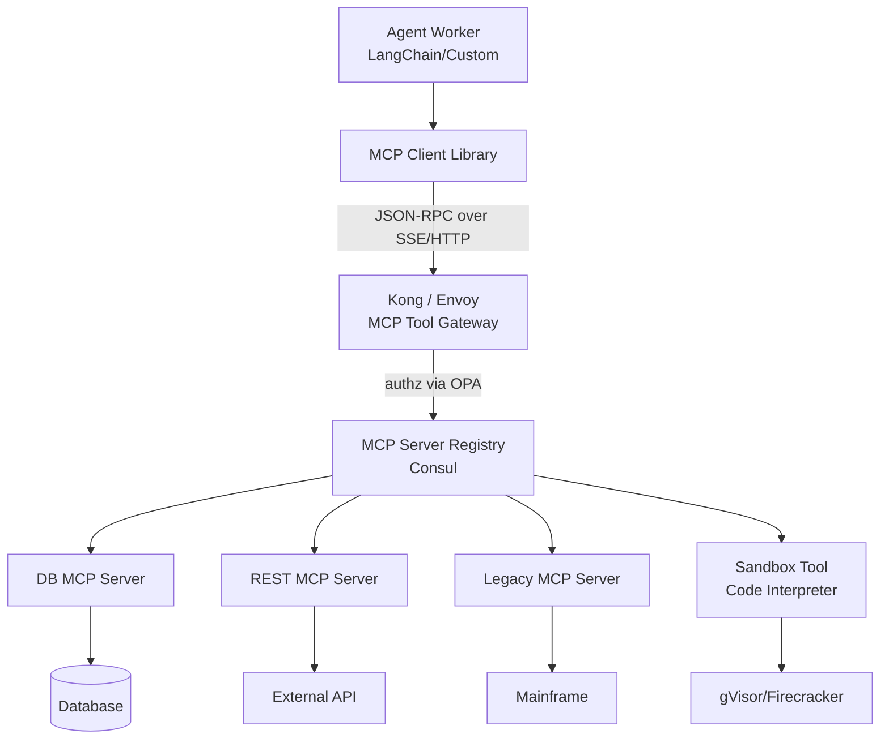

**Key Points (Domains 13, 19, 56)**
- MCP servers are microservices registered in service discovery with label `mcp-tool: true`.
- Agent identity (SPIFFE) injected via mesh; OPA authorizes tool access.
- MCP servers obtain dynamic DB credentials from Vault.
- Code execution sandbox is an MCP tool wrapping gVisor.

#### 4.2 Agent‑to‑Agent (A2A) Communication

Agents communicate asynchronously using the existing event backbone (Kafka/NATS) with a standard envelope, avoiding a separate protocol.

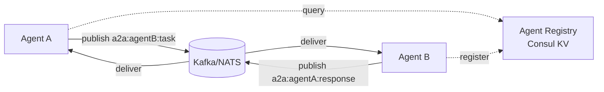

**Envelope example:** `{taskId, fromAgent, replyTo, type, payload, ttl}`  
Long‑running A2A tasks are managed by the process engine (Layer 5) which tracks state and handles timeouts.

#### 4.3 Agent Memory Architecture

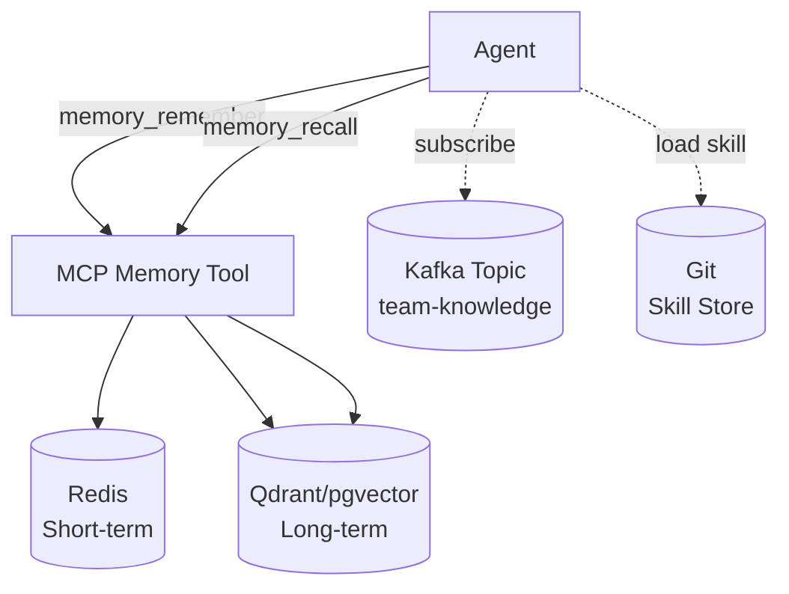

**Domain 13 – Agent Memory**: Short‑term conversation in Redis, long‑term facts in vector DB, shared team knowledge in Kafka, procedural skills in Git.

#### 4.4 Multi‑Agent Interaction Strategies

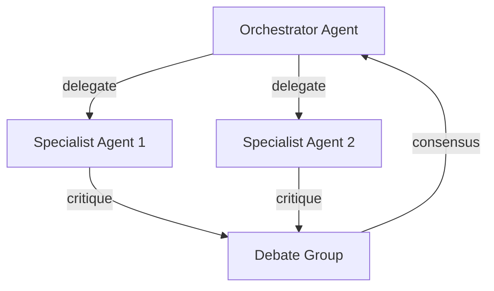

**Domain 13 – Multi‑Agent Strategies:** Coordination, hierarchical manager‑worker, debate, self‑refinement. Implemented via LangGraph or custom orchestration over Kafka.

#### 4.5 Content Processing Engine (Domain 20)

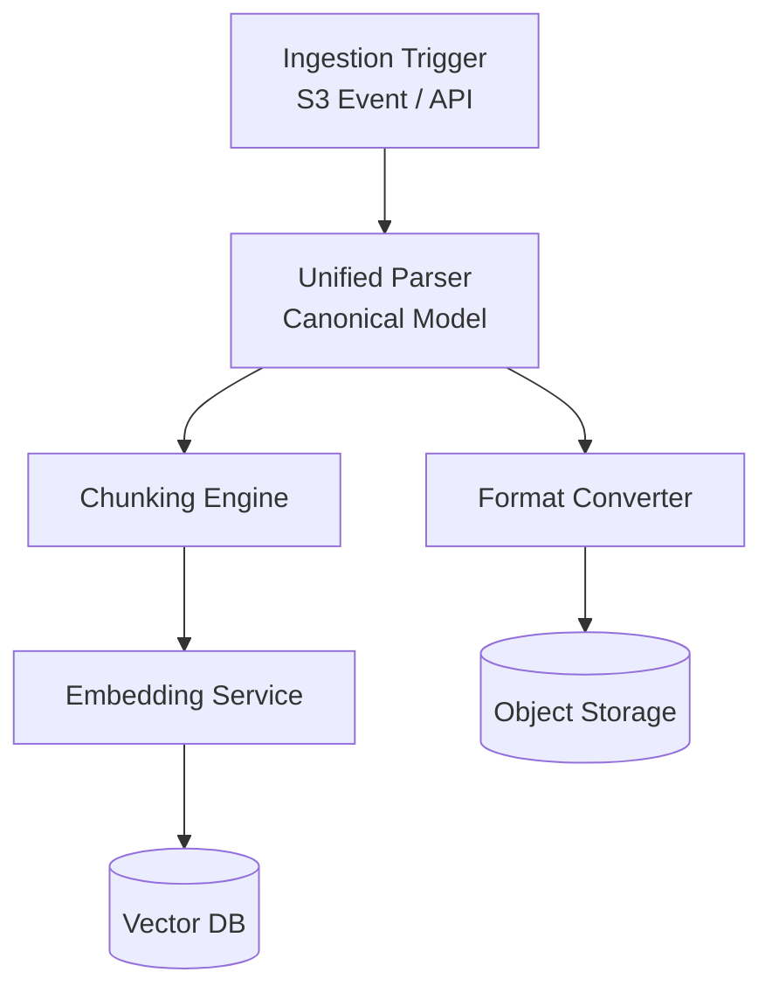

The engine handles documents, spreadsheets, CAD, presentations, raw data, multimedia. It parses into a unified model, chunks, embeds, and converts formats. Also serves as a message serialisation/deserialisation utility.

#### 4.6 Business Process Engine Deep‑Dive (Domain 17, Layer 5 crossover)

The process engine is a first‑class runtime in Layer 5 but deeply integrates with Layer 4.

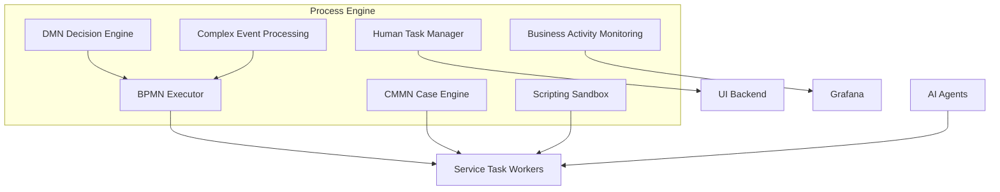

**Domains covered:** 17 (full), 10 (sagas), 13 (agentic workflows).  
- BPMN processes call MCP tools as service tasks.
- Human tasks are rendered via the UI Backend using Formily forms.
- CEP detects patterns across events and triggers processes.
- Agent workflows are modelled as BPMN/CMMN definitions, enabling durable execution, compensation, and audit.

#### 4.7 Scheduling, Digital Twins, and Blockchain (Domains 35, 36, 44)

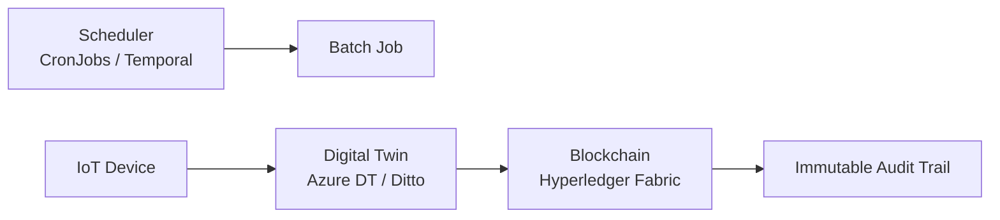

Scheduled jobs run periodic tasks. Digital twins mirror physical assets and write critical state changes to a blockchain for tamper‑proof audit.

---

### 5. Layer 5 – Application‑Adjacent Runtimes & Platform Services

**Overview**  
Service mesh, process engine (detailed above), knowledge & analytics, search, notifications, MLOps, synthetic data, quantum‑safe crypto.

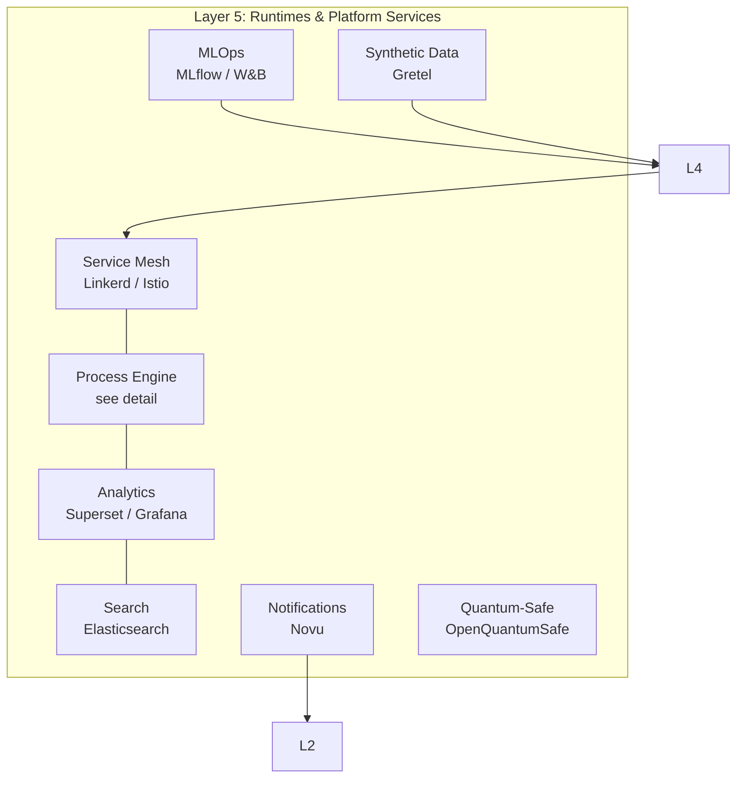

**Key Domains**
- **Domain 4 – Service Mesh:** automatic mTLS, retries, circuit breaking.
- **Domain 17 – Process Engine:** detailed above, also manages sagas (Domain 10).
- **Domain 18 – Knowledge & Analytics:** BI (Superset), ML model serving, RAG pipelines, process mining.
- **Domain 40 – Search:** full‑text search, hybrid vector search.
- **Domain 37 – Notifications:** multi‑channel delivery.
- **Domain 42 – MLOps/LLMOps:** experiment tracking, prompt versioning, model registry.
- **Domain 43 – Synthetic Data:** privacy‑safe data for testing.
- **Domain 45 – Quantum‑Safe Crypto:** post‑quantum algorithm integration.

---

### 6. Layer 6 – Persistence, State & Data Pipeline Infrastructure

**Overview**  
All persistent stores, caching, event streaming, CDC/ETL, backup/DR, archival, schema migrations.

```mermaid
flowchart TB
    subgraph L6[Layer 6: Persistence & Data Pipelines]
        direction LR
        subgraph Databases
            RDB[(PostgreSQL)]
            Doc[(MongoDB)]
            Graph[(Neo4j)]
            Vec[(Qdrant)]
            TS[(InfluxDB)]
            Obj[(MinIO/S3)]
        end
        subgraph Caching
            Cache[(Redis)]
        end
        subgraph Streaming
            Events[(Kafka)]
        end
        subgraph Pipelines
            CDC[Debezium]
            ETL[Airflow + dbt]
        end
        subgraph Resilience
            Backup[Velero]
            Archive[S3 Glacier]
            Migrate[Flyway]
        end
    end
    L5 --> Databases
    L5 --> Cache
    L5 --> Events
    CDC --> Events
    ETL --> Databases
    Backup --> Obj
    Archive --> Obj
    Migrate --> RDB
```

**Domains Covered**
- Domain 16 – Data Persistence & Storage (all DB types).
- Domain 7 – State & Caching.
- Domain 9 – Event Streaming.
- Domain 34 – Data Pipeline & Ingestion (CDC, ETL, stream processing).
- Domain 27 – Disaster Recovery (backup, replication).
- Domain 49 – Session & State Replication (Redis cluster).
- Domain 52 – Block Storage & NFS (Rook/Ceph, Longhorn) – persistent volumes for DBs.
- Domain 54 – Time Synchronisation (chrony, TrueTime) – for consistent timestamps.
- Domain 55 – Document Lifecycle (S3 Object Lock).
- Domain 60 – Schema & Database Migration (Flyway).
- Domain 61 – Data Archival & Cold Storage.

---

### 7. Layer 7 – Foundation & Governance Infrastructure

This is the largest layer, so it is further divided into sub‑systems.

#### 7.1 Core Platform & Discovery

```mermaid
flowchart TB
    subgraph Core[Core Platform]
        K8s[Kubernetes]
        Consul[Consul\nDiscovery & KV]
        Vault[Vault\nSecrets]
    end
    L6 --> K8s
    K8s --- Consul
    K8s --- Vault
```

**Domains 1, 2, 8**

#### 7.2 Delivery & DevOps

```mermaid
flowchart LR
    Dev[Developer]
    Backstage[Backstage\nDev Portal]
    CICD[CI/CD\nGitHub Actions]
    GitOps[GitOps\nArgo CD]
    Env[Environment Mgmt\nArgo AppSets]
    Test[Testing\nk6, Playwright]
    
    Dev --> Backstage
    Backstage --> CICD
    CICD --> GitOps
    GitOps --> Env
    Test --> CICD
```

**Domains 21, 22, 23, 58, 59**

#### 7.3 Governance & Security

```mermaid
flowchart TB
    IAM[IAM\nKeycloak, OPA]
    Compliance[Compliance\nVanta, Drata]
    Cost[Cost\nKubecost]
    MultiTenant[Multi-Tenancy\nRLS, Kong]
    Privacy[Data Privacy\nDLP, Vault Transform]
    HSM[HSM\nCloudHSM]
    NetworkPolicy[Network Policy\nCalico]
    Incident[Incident Response\nSplunk]
    Sustain[Sustainability\nKepler]
    
    IAM --> APIGW
    Compliance --> Core
    Cost --> Core
    MultiTenant --> L2
    Privacy --> L6
    HSM --> Vault
    NetworkPolicy --> Core
    Incident --> Core
    Sustain --> Core
```

**Domains 24, 25, 26, 29, 33, 56, 57, 62, 63**

#### 7.4 Observability

```mermaid
flowchart LR
    OTel[OpenTelemetry Collector]
    Grafana[Grafana LGTM]
    LangSmith[LangSmith]
    Agents[AI Agents]
    Services[Microservices]
    
    Agents --> OTel
    Services --> OTel
    OTel --> Grafana
    Agents --> LangSmith
    LangSmith --> Grafana
```

**Domain 11 – Observability**, extended with **Domain 42 – LLM observability**.

---

### 8. Full‑System Interaction Example: Agent Research Task

1. User requests research via UI (Layer 2).
2. BFF sends message to A2A queue (Layer 4).
3. Orchestrator agent (process engine workflow, Layer 5) picks up task.
4. Workflow calls MCP tools (database query, web search) via Layer 3.
5. Content processing engine (Layer 4) ingests retrieved documents, chunks, embeds.
6. Memory service (Layer 4) stores results in Redis and Qdrant (Layer 6).
7. Process engine waits for human approval (Layer 5 → Layer 2 UI).
8. Final summary is published back to user via WebSocket (Layer 2).
9. Observability traces span all layers (Layer 7).

```mermaid
sequenceDiagram
    actor User
    participant BFF as BFF (L2)
    participant A2A as A2A Bus (L4)
    participant PE as Process Engine (L5)
    participant MCP as MCP Server (L3)
    participant Content as Content Engine (L4)
    participant Mem as Memory (L6)
    
    User->>BFF: Research request
    BFF->>A2A: publish task
    A2A->>PE: start workflow
    PE->>MCP: call tool (search)
    MCP-->>PE: results
    PE->>Content: ingest & chunk
    Content->>Mem: store embeddings
    PE->>BFF: request human approval
    BFF->>User: display approval form
    User->>BFF: approve
    BFF->>PE: signal
    PE->>BFF: publish summary
    BFF->>User: display result
```

---
