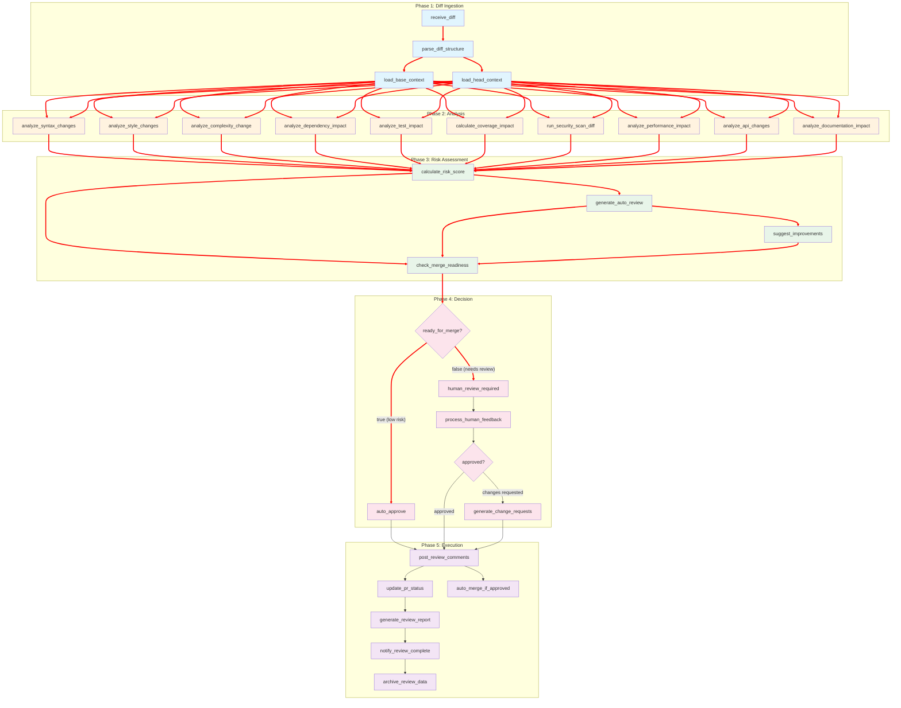

# diff_reviewer.json
Here's the comprehensive `diff_reviewer.json` for intelligent code diff analysis, review, and integration:


## Mermaid Dependency Graph



## Key Features of Diff Reviewer Workflow:

### 1. **Comprehensive Diff Analysis**
- File-level and line-level change detection
- Binary file detection
- Hunk parsing and metadata extraction
- Before/after context loading

### 2. **Multi-Dimensional Analysis**

| Analysis Type | Component | Focus Areas |
|---------------|-----------|-------------|
| Syntax | mypy_validator | Type errors, syntax correctness |
| Style | ruff_validator | Code style, formatting, best practices |
| Complexity | complexity_validator | Cyclomatic, cognitive complexity |
| Dependencies | dependency_validator | Import changes, circular deps |
| Tests | test_runner | Affected tests, new test needs |
| Coverage | coverage_analyzer | Coverage impact analysis |
| Security | security_validator | Vulnerability detection |
| Performance | performance_validator | Algorithm changes, regressions |
| API | api_surface_extractor | Breaking changes, compatibility |
| Documentation | docstring_validator | Docstring updates needed |

### 3. **Risk Scoring Algorithm**

```javascript
risk_score = (
    syntax_issues * 25 +
    critical_security_issues * 30 +
    breaking_changes * 20 +
    complexity_increase * 10 +
    coverage_decrease * 10 +
    performance_degradation * 5
) / 100

Risk Levels:
- 0-30: Low Risk (Auto-approve)
- 31-60: Medium Risk (Human review recommended)
- 61-100: High Risk (Required human review)
```

### 4. **Auto-Review Generation**
- LLM-powered review comments
- Inline code suggestions
- Constructive feedback formatting
- Context-aware recommendations

### 5. **Human Review Interface**

| Feature | Description |
|---------|-------------|
| Diff Visualization | Side-by-side comparison |
| Risk Assessment | Color-coded risk indicators |
| Auto Comments | Pre-populated review comments |
| Decision Options | Approve, Request Changes, Comment |
| Timeout | 12-24 hours based on risk |

### 6. **Merge Readiness Criteria**

Auto-merge allowed when:
- Risk score ≤ 30
- No critical security issues
- No syntax errors
- No breaking API changes
- Tests pass (if applicable)

### 7. **PR Integration**

| Action | Method |
|--------|--------|
| Post comments | Inline and summary comments |
| Update status | Success/Pending/Failure |
| Request changes | Block merge until resolved |
| Auto-merge | Squash merge with branch deletion |

### 8. **Review Outputs**

```yaml
Outputs:
  - Review comments (inline + summary)
  - Risk assessment report
  - Suggested improvements
  - Change requests (if needed)
  - Approval status
  - Merge decision
```

### 9. **Security Scan Rules**
- SQL Injection detection
- XSS vulnerability scanning
- Command injection patterns
- Hardcoded secret detection
- Weak cryptography identification
- Path traversal vulnerabilities

### 10. **Performance Impact Detection**
- Algorithm complexity changes (O(n) → O(n²))
- Database query pattern changes
- Memory usage implications
- Caching pattern modifications

### 11. **API Compatibility Check**
- Breaking change detection
- Deprecated API usage
- Parameter type changes
- Return type modifications
- Exception specification changes

### 12. **Test Impact Analysis**
- Identify affected tests
- Suggest new test cases
- Coverage impact prediction
- Regression risk assessment

### 13. **Documentation Impact**
- Detect docstring changes
- Identify undocumented functions
- Suggest documentation updates
- API documentation coverage

### 14. **Notification Channels**
- Slack (real-time updates)
- Event bus (system integration)
- PR comments (GitHub/GitLab)
- Email (for critical issues)

### 15. **Review Decision Flow**

```
Diff Received
    ↓
Auto Analysis
    ↓
Risk Score ≤ 30? 
    ↓ YES → Auto Approve → Auto Merge
    ↓ NO → Human Review Required
           ↓
        Human Decision
           ↓
    Approve → Merge
    Request Changes → Post Changes → Wait for Update
```

This workflow provides comprehensive, intelligent code review with appropriate automation for low-risk changes and thorough human oversight for complex or risky modifications.