Here's the comprehensive `full_pipeline.json` that orchestrates the complete development pipeline from requirements to deployment, integrating all previous workflows:


## Mermaid Pipeline Diagram

```mermaid
graph TD
    subgraph "Pipeline Orchestration"
        A[Initialize Pipeline]
        B[Validate Prerequisites]
    end

    subgraph "Stage 1: Analysis"
        C[Execute Analysis Workflow]
        D[Process Analysis Results]
        E{Quality Threshold Met?}
    end

    subgraph "Stage 2: Planning"
        F[Execute Planning Workflow]
        G[Process Planning Results]
    end

    subgraph "Stage 3: Generation"
        H[Execute Generation Workflow]
        I[Process Generation Results]
    end

    subgraph "Stage 4: Diff Review"
        J[Execute Diff Review]
        K[Process Diff Results]
    end

    subgraph "Stage 5: Code Review"
        L[Execute Code Review]
        M[Process Review Results]
        N{Approved?}
    end

    subgraph "Stage 6: Quality"
        O[Execute Quality Workflow]
        P[Process Quality Results]
        Q{Quality Passed?}
    end

    subgraph "Stage 7: Refinement"
        R[Execute Refinement]
        S[Process Refinement Results]
        T{Conflicts?}
    end

    subgraph "Stage 8: Conflict Resolution"
        U[Execute Conflict Resolution]
        V[Process Conflict Results]
    end

    subgraph "Stage 9: Approval"
        W[Execute Approval Workflow]
        X[Process Approval Results]
        Y{Approved?}
    end

    subgraph "Stage 10: Deployment"
        Z[Execute Deployment]
        AA[Process Deployment Results]
        AB[Verify Deployment]
        AC[Create Release Tag]
    end

    subgraph "Finalization"
        AD[Generate Pipeline Report]
        AE[Notify Completion]
        AF[Archive Pipeline Data]
    end

    %% Pipeline Flow
    A --> B --> C --> D --> E
    
    E -- "Pass" --> F
    E -- "Fail" --> AD
    
    F --> G --> H --> I --> J --> K --> L --> M --> N
    
    N -- "Approved" --> O
    N -- "Changes Requested" --> H
    
    O --> P --> Q
    
    Q -- "Pass" --> W
    Q -- "Fail" --> R
    
    R --> S --> T
    
    T -- "Has Conflicts" --> U --> V --> W
    T -- "No Conflicts" --> W
    
    W --> X --> Y
    
    Y -- "Approved" --> Z
    Y -- "Rejected" --> AD
    
    Z --> AA --> AB --> AC --> AD --> AE --> AF

    %% Styling
    classDef analysis fill:#e1f5fe
    classDef planning fill:#fff3e0
    classDef generation fill:#e8f5e9
    classDef review fill:#fce4ec
    classDef quality fill:#f3e5f5
    classDef refinement fill:#ffe0b2
    classDef approval fill:#c8e6c9
    classDef deployment fill:#d1c4e9
    classDef final fill:#b2dfdb
    
    class C,D,E analysis
    class F,G planning
    class H,I generation
    class J,K,L,M,N review
    class O,P,Q quality
    class R,S,T refinement
    class U,V conflict
    class W,X,Y approval
    class Z,AA,AB,AC deployment
    class AD,AE,AF final
```



## Detailed Stage Dependencies Diagram

```mermaid
graph LR
    subgraph "Stage 1: Analysis (4 hours)"
        A1[Project Scan]
        A2[Metrics Collection]
        A3[Quality Assessment]
        A4[Security Scan]
        A1 --> A2 --> A3 --> A4
    end

    subgraph "Stage 2: Planning (8 hours)"
        B1[Requirements Analysis]
        B2[Task Decomposition]
        B3[Dependency Mapping]
        B4[Resource Planning]
        B1 --> B2 --> B3 --> B4
    end

    subgraph "Stage 3: Generation (12 hours)"
        C1[Code Generation]
        C2[Test Generation]
        C3[Doc Generation]
        C4[Iterative Refinement]
        C1 --> C2 --> C3 --> C4
    end

    subgraph "Stage 4: Diff Review (4 hours)"
        D1[Diff Analysis]
        D2[Impact Assessment]
        D3[Auto Comments]
        D1 --> D2 --> D3
    end

    subgraph "Stage 5: Code Review (48 hours)"
        E1[Technical Review]
        E2[Security Review]
        E3[Performance Review]
        E4[Architecture Review]
        E1 --> E2
        E1 --> E3
        E1 --> E4
    end

    subgraph "Stage 6: Quality (6 hours)"
        F1[Static Analysis]
        F2[Test Execution]
        F3[Coverage Check]
        F4[Quality Gate]
        F1 --> F2 --> F3 --> F4
    end

    subgraph "Stage 7: Refinement (8 hours)"
        G1[Identify Issues]
        G2[Apply Fixes]
        G3[Revalidate]
        G4[Iterate]
        G1 --> G2 --> G3 --> G4
        G4 -.-> G1
    end

    subgraph "Stage 8: Conflict Resolution (4 hours)"
        H1[Analyze Conflicts]
        H2[Generate Resolution]
        H3[Apply Resolution]
        H4[Validate]
        H1 --> H2 --> H3 --> H4
    end

    subgraph "Stage 9: Approval (72 hours)"
        I1[Technical Approval]
        I2[Security Approval]
        I3[Legal Approval]
        I4[Executive Approval]
        I1 --> I4
        I2 --> I4
        I3 --> I4
    end

    subgraph "Stage 10: Deployment (4 hours)"
        J1[Build Artifacts]
        J2[Deploy to Staging]
        J3[Run Smoke Tests]
        J4[Deploy to Production]
        J1 --> J2 --> J3 --> J4
    end

    %% Cross-stage dependencies
    A4 --> B1
    B4 --> C1
    C4 --> D1
    D3 --> E1
    E4 --> F1
    F4 --> G1
    G4 --> H1
    H4 --> I1
    I4 --> J1

    %% Styling
    classDef analysis fill:#e1f5fe,stroke:#01579b
    classDef planning fill:#fff3e0,stroke:#e65100
    classDef generation fill:#e8f5e9,stroke:#1b5e20
    classDef review fill:#fce4ec,stroke:#880e4f
    classDef quality fill:#f3e5f5,stroke:#4a148c
    classDef refinement fill:#ffe0b2,stroke:#bf360c
    classDef approval fill:#c8e6c9,stroke:#1b5e20
    classDef deployment fill:#d1c4e9,stroke:#311b92
    
    class A1,A2,A3,A4 analysis
    class B1,B2,B3,B4 planning
    class C1,C2,C3,C4 generation
    class D1,D2,D3 review
    class E1,E2,E3,E4 review
    class F1,F2,F3,F4 quality
    class G1,G2,G3,G4 refinement
    class H1,H2,H3,H4 conflict
    class I1,I2,I3,I4 approval
    class J1,J2,J3,J4 deployment
```



## Pipeline Timeline Gantt Chart

```mermaid
gantt
    title Full Pipeline Execution Timeline
    dateFormat HH:mm
    axisFormat %H:%M
    
    section Stage 1: Analysis
    Project Scan        :a1, 00:00, 1h
    Metrics Collection  :a2, after a1, 1h
    Quality Assessment  :a3, after a2, 1h
    Security Scan       :a4, after a3, 1h
    
    section Stage 2: Planning
    Requirements        :b1, after a4, 2h
    Task Decomposition  :b2, after b1, 2h
    Dependency Mapping  :b3, after b2, 2h
    Resource Planning   :b4, after b3, 2h
    
    section Stage 3: Generation
    Code Generation     :c1, after b4, 4h
    Test Generation     :c2, after c1, 3h
    Doc Generation      :c3, after c2, 2h
    Refinement          :c4, after c3, 3h
    
    section Stage 4: Review
    Diff Analysis       :d1, after c4, 1h
    Impact Assessment   :d2, after d1, 2h
    Auto Comments       :d3, after d2, 1h
    
    section Stage 5: Code Review
    Technical Review    :e1, after d3, 24h
    Security Review     :e2, after d3, 24h
    Performance Review  :e3, after d3, 24h
    Architecture Review :e4, after d3, 24h
    Approval Wait       :crit, after e1, 24h
    
    section Stage 6: Quality
    Static Analysis     :f1, after e1, 2h
    Test Execution      :f2, after f1, 2h
    Coverage Check      :f3, after f2, 1h
    Quality Gate        :f4, after f3, 1h
    
    section Stage 7: Refinement
    Identify Issues     :g1, after f4, 2h
    Apply Fixes         :g2, after g1, 3h
    Revalidate          :g3, after g2, 2h
    Iterate             :g4, after g3, 1h
    
    section Stage 8: Conflicts
    Analyze Conflicts   :h1, after g4, 1h
    Generate Resolution :h2, after h1, 1h
    Apply Resolution    :h3, after h2, 1h
    Validate            :h4, after h3, 1h
    
    section Stage 9: Approval
    Technical Approval  :i1, after h4, 24h
    Security Approval   :i2, after h4, 24h
    Legal Approval      :i3, after h4, 24h
    Executive Approval  :i4, after i1, 24h
    
    section Stage 10: Deployment
    Build Artifacts     :j1, after i4, 1h
    Deploy Staging      :j2, after j1, 1h
    Smoke Tests         :j3, after j2, 1h
    Deploy Production   :j4, after j3, 1h
```



## Key Features of Full Pipeline Workflow:

### 1. **Pipeline Stages Overview**

| Stage | Workflow | Duration | Dependencies | Critical Path |
|-------|----------|----------|--------------|---------------|
| 1 | Analysis | 4 hours | None | Yes |
| 2 | Planning | 8 hours | Stage 1 | Yes |
| 3 | Generation | 12 hours | Stage 2 | Yes |
| 4 | Diff Review | 4 hours | Stage 3 | Yes |
| 5 | Code Review | 48 hours | Stage 4 | Yes |
| 6 | Quality | 6 hours | Stage 5 | Yes |
| 7 | Refinement | 8 hours | Stage 6 | Conditional |
| 8 | Conflict Resolution | 4 hours | Stage 7 | Conditional |
| 9 | Approval | 72 hours | Stages 5,8 | Yes |
| 10 | Deployment | 4 hours | Stage 9 | Yes |

### 2. **Pipeline Configuration**

```yaml
pipeline_config:
  auto_continue: true        # Automatically proceed to next stage
  fail_fast: true            # Stop on critical failure
  parallel_stages: true      # Run independent stages in parallel
  checkpoint_interval: 5     # Save state every 5 stages
  max_duration_hours: 168    # Maximum pipeline duration (7 days)
```

### 3. **Stage Transition Conditions**

| Transition | Condition | Action |
|------------|-----------|--------|
| Stage 1 → 2 | Quality ≥ 60% | Proceed |
| Stage 1 → Fail | Quality < 60% | Pipeline fails |
| Stage 5 → 6 | Approved | Proceed |
| Stage 5 → 3 | Changes requested | Loop back |
| Stage 6 → 7 | Quality < 85% | Refinement |
| Stage 6 → 9 | Quality ≥ 85% | Skip refinement |

### 4. **Quality Gates**

```javascript
// Stage 1 Gate
analysis_gate = quality_score >= 60 AND critical_issues <= 5

// Stage 5 Gate  
review_gate = approvals >= 2 AND NOT changes_requested

// Stage 6 Gate
quality_gate = quality_score >= 85 AND coverage >= 80

// Stage 9 Gate
approval_gate = all_required_approvals_met
```

### 5. **Parallel Execution Opportunities**

| Parallel Group | Stages |
|----------------|--------|
| Analysis | Metrics + Security + Dependencies |
| Planning | Decomposition + Resource Planning |
| Code Review | Technical + Security + Performance |
| Approval | Technical + Security + Legal |

### 6. **Artifact Flow**

```
Analysis Report → Planning → Design Document
                           ↓
                    Generation → Code + Tests + Docs
                           ↓
                      Diff Review → Review Comments
                           ↓
                       Code Review → Approvals
                           ↓
                    Quality → Quality Report
                           ↓
                     Refinement → Improved Code
                           ↓
                  Conflict Resolution → Resolved Code
                           ↓
                      Approval → Certificate
                           ↓
                     Deployment → Live System
```

### 7. **Error Recovery Strategies**

| Failure Type | Recovery Action | Retry Limit |
|--------------|-----------------|-------------|
| Analysis failure | Retry with reduced scope | 2 |
| Generation failure | Retry with different strategy | 3 |
| Review timeout | Escalate to management | 1 |
| Quality failure | Trigger refinement | 3 |
| Deployment failure | Rollback + alert | 2 |

### 8. **Pipeline Metrics Tracked**

```yaml
metrics:
  - total_duration_hours
  - stages_completed
  - stages_failed
  - quality_score
  - test_coverage
  - security_score
  - deployment_success
  - rollback_count
```

### 9. **Notification Events**

| Event | Channels | Priority |
|-------|----------|----------|
| Stage Complete | Dashboard | Low |
| Stage Failure | Slack, Email | High |
| Review Required | Slack, Email | Medium |
| Approval Needed | Email | High |
| Pipeline Complete | All | Medium |

### 10. **Checkpoint & Recovery**

- Automatic state saving every 5 stages
- Resume from last successful checkpoint
- Partial results preservation
- Artifact versioning

### 11. **Deployment Strategies**

| Strategy | Description | Downtime |
|----------|-------------|----------|
| Blue-Green | Switch between environments | Zero |
| Canary | Gradual rollout | Zero |
| Rolling | Progressive update | Minimal |
| Big Bang | Complete replacement | Significant |

### 12. **Success Criteria**

Pipeline is successful when:
- All required stages completed
- Quality score ≥ 85%
- All approvals obtained
- Deployment verified
- Smoke tests passed

### 13. **Estimated Timeline**

| Phase | Duration | Cumulative |
|-------|----------|------------|
| Analysis + Planning | 12 hours | 0.5 days |
| Generation | 12 hours | 1 day |
| Code Review | 48 hours | 3 days |
| Quality + Refinement | 14 hours | 3.5 days |
| Approval | 72 hours | 6.5 days |
| Deployment | 4 hours | 7 days |

### 14. **Resource Requirements**

| Stage | CPU | Memory | Network |
|-------|-----|--------|---------|
| Analysis | 4 cores | 8 GB | Low |
| Generation | 8 cores | 16 GB | Medium |
| Testing | 4 cores | 8 GB | Low |
| Deployment | 2 cores | 4 GB | High |

### 15. **Integration Points**

- **Version Control**: Git/GitHub/GitLab
- **CI/CD**: Jenkins/GitHub Actions/GitLab CI
- **Monitoring**: Prometheus/Grafana/DataDog
- **Notification**: Slack/Email/PagerDuty
- **Storage**: S3/GCS/Azure Blob

This full pipeline orchestrates all individual workflows into a cohesive, end-to-end development process with proper stage sequencing, error handling, quality gates, and comprehensive reporting.