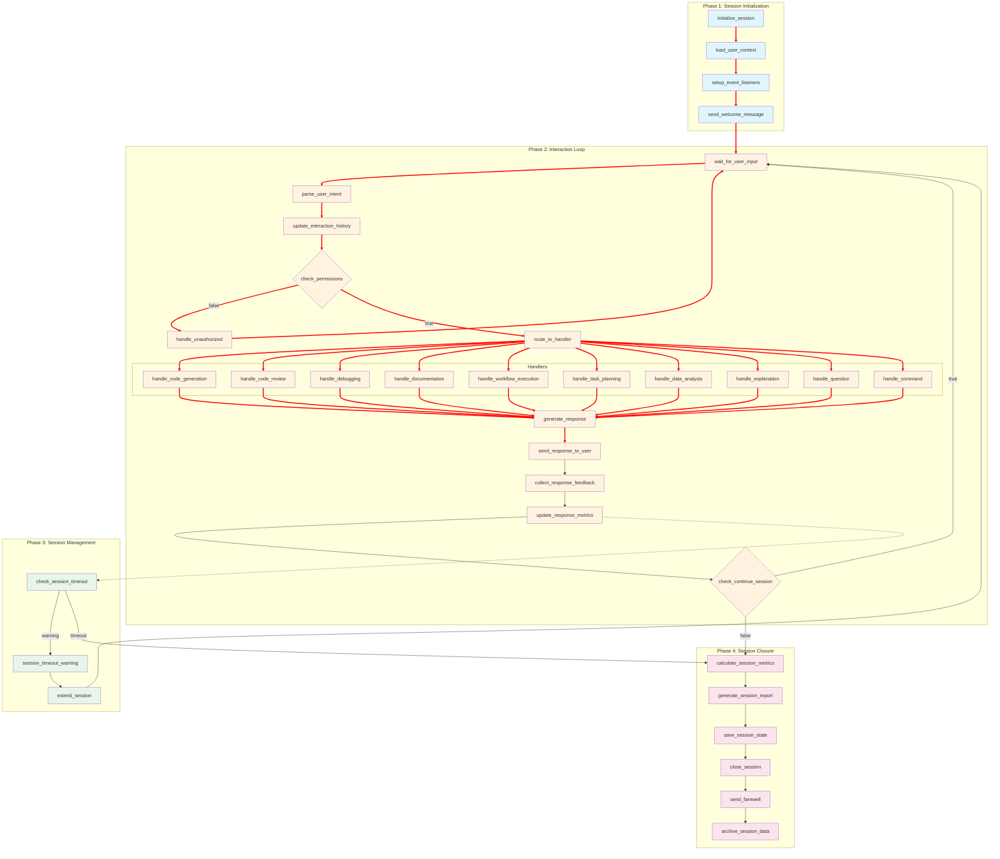

Here's the comprehensive `interactive_session.json` for managing interactive sessions between humans and the AI system:

## Mermaid Dependency Graph



## Key Features of Interactive Session Workflow:

### 1. **Session Management**
- Session initialization with timeout controls
- User context loading and persistence
- Event listener setup for real-time communication
- Session state saving and archiving

### 2. **Intent Recognition**
- Multi-category intent parsing (10+ intent types)
- Entity extraction from user input
- Confidence scoring (threshold 0.7)
- Context-aware understanding

### 3. **Supported Intent Types**
| Intent | Handler | Use Case |
|--------|---------|----------|
| code_generation | function_generator | Generate code from description |
| code_review | code_review_skill | Review code quality |
| debugging | error_analyzer | Analyze and fix errors |
| documentation | docstring_generator | Generate documentation |
| workflow_execution | workflow_executor | Run workflows |
| task_planning | task_decomposer | Break down tasks |
| data_analysis | custom_analyzer | Analyze data |
| explanation | llm_client | Explain concepts |
| question | llm_client | Answer questions |
| command | system | Execute commands |

### 4. **Response Generation**
- Formatted responses with markdown
- Code block formatting
- Suggested follow-up actions
- Response time tracking

### 5. **Feedback Collection**
- Per-response rating (helpful/somewhat/not)
- Optional detailed feedback
- Aggregate satisfaction scoring
- Continuous improvement loop

### 6. **Session Quality Metrics**
| Metric | Description | Target |
|--------|-------------|--------|
| Clarity Score | Response clarity | > 85% |
| Relevance Score | Relevance to query | > 90% |
| Completeness Score | Answer completeness | > 85% |
| Overall Score | Weighted average | > 87% |

### 7. **Permission System**
- User-based permission checking
- Role-based access control
- Unauthorized request handling
- Permission escalation suggestions

### 8. **Timeout Management**
| Stage | Timeout | Action |
|-------|---------|--------|
| User input | 30 minutes | Warning then timeout |
| Session max | 480 minutes | Auto-close |
| Response feedback | 2 minutes | Skip if no response |

### 9. **Response Metrics Tracked**
- Total interactions per session
- Average response time (ms)
- Success rate per intent
- User satisfaction score
- Intent distribution analysis

### 10. **Session Persistence**
- Full session state saving
- Interaction history storage
- Report generation (HTML)
- Data archiving (90 days retention)

### 11. **Communication Channels**
| Channel | Purpose |
|---------|---------|
| WebSocket | Real-time bidirectional communication |
| Event Bus | Internal event propagation |
| State Manager | Session state persistence |
| Notifications | User alerts and warnings |

### 12. **Error Handling**
- Permission denied responses
- Intent confidence fallback
- Timeout recovery
- Graceful session termination

### 13. **Session Lifecycle**
```
INITIALIZING → ACTIVE → (TIMEOUT WARNING) → EXTENDED → CLOSING → ARCHIVED
                    ↓
              USER EXIT → CLOSING → ARCHIVED
```

### 14. **Follow-up Suggestions**
- Context-aware next actions
- Related commands
- Workflow recommendations
- Documentation links

This workflow enables rich, interactive human-AI conversations with intelligent intent routing, context preservation, quality tracking, and comprehensive session management.