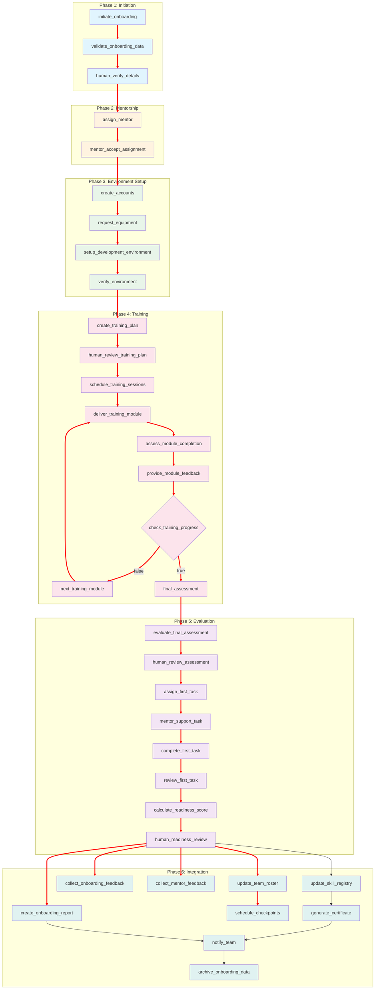

Here's the comprehensive `onboarding_workflow.json` for managing new team member onboarding, training, and integration:

## Mermaid Dependency Graph

## Key Features of Onboarding Workflow:

### 1. **Pre-Onboarding Phase**
- Data validation and verification
- Manager approval
- Resource allocation planning

### 2. **Mentorship Assignment**
- Smart mentor matching based on skills and availability
- Mentor acceptance workflow
- Mentoring guidelines and expectations

### 3. **Account & Environment Setup**
- Multi-system account creation
- Equipment provisioning
- Development environment configuration
- Access permission management

### 4. **Personalized Training**
- Role-specific training modules
- Experience level adaptation
- Interactive training delivery
- Module assessment with passing score (80%)
- Feedback collection per module

### 5. **Training Modules Structure**
| Module Type | Examples | Duration |
|-------------|----------|----------|
| Core | Project overview, coding standards | 2-3 days |
| Role-specific | API dev, DevOps, QA, Frontend | 5-7 days |
| Advanced