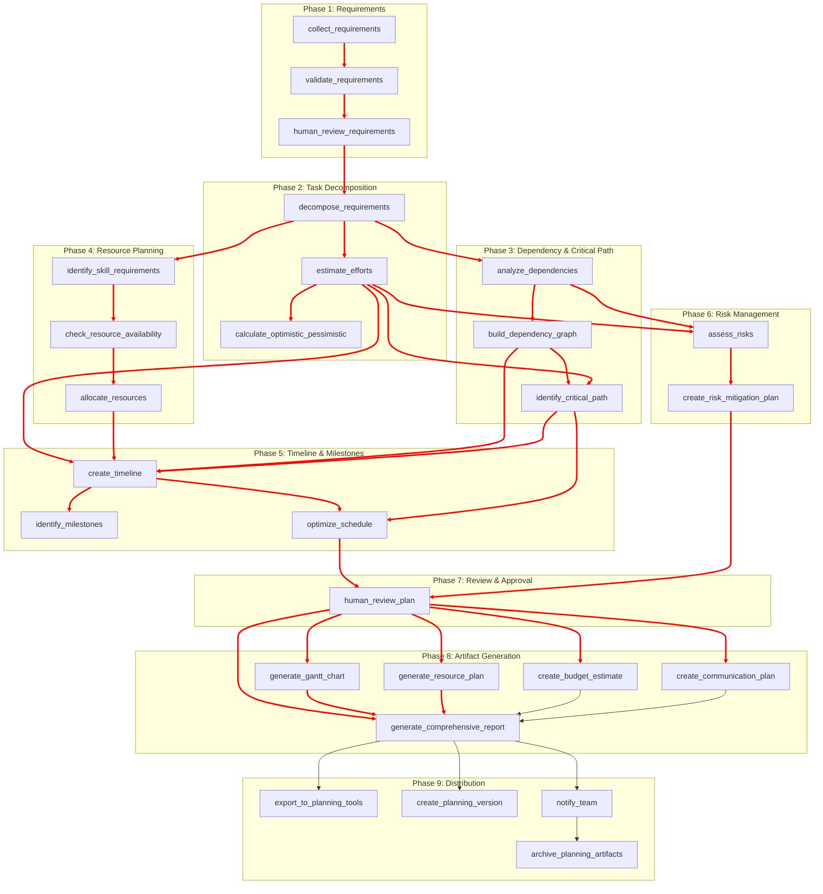

# planning_workflow.json
Here's the comprehensive `planning_workflow.json` for managing project planning, task decomposition, dependency mapping, and resource allocation:

## Mermaid Dependency Graph

## Key Features of Planning Workflow:

### 1. **Requirements Analysis**
- Multi-source requirement collection
- Completeness and consistency validation
- Human review with approval
- Prioritization framework

### 2. **Task Decomposition**
- WBS (Work Breakdown Structure) creation
- Functional decomposition
- Task sizing guidelines (2-40 hours)
- Hierarchical task organization

### 3. **Dependency Analysis**
- Multi-type dependency detection (functional, data, resource, temporal)
- Circular dependency detection
- Parallelizable group identification
- Dependency graph construction

### 4. **Critical Path Method (CPM)**
- Critical path identification
- Slack calculation
- Bottleneck detection
- Path duration analysis

### 5. **Effort Estimation**
- Three-point estimation (optimistic, most likely, pessimistic)
- PERT formula for expected duration
- Confidence intervals (68%, 95%, 99%)
- Historical data calibration

### 6. **Resource Planning**
- Skill requirement extraction
- Resource availability checking
- Workload balancing
- Skill-based assignment optimization

### 7. **Timeline Creation**
- Gantt chart generation
- Buffer allocation (15% default)
- Working days/hours configuration
- Milestone identification

### 8. **Risk Assessment**
- Multi-category risk identification
- Risk scoring (probability × impact)
- Mitigation strategy development
- Contingency planning

### 9. **Budget Estimation**
- Resource cost calculation
- Infrastructure and tool costs
- Contingency budgeting (15%)
- ROI calculation

### 10. **Communication Planning**
- Stakeholder mapping
- Communication frequency definition
- Channel configuration
- Template generation

### 11. **Output Artifacts**
- HTML comprehensive report
- Gantt chart with dependencies
- Resource workload heatmap
- Risk register with mitigation plans

### 12. **Integration Points**
- External planning tools (Jira, Asana, MS Project)
- State manager for versioning
- Git for plan snapshots
- Notification systems (Slack, email)

### 13. **Optimization Features**
- Parallelization of independent tasks
- Fast-tracking critical path
- Resource leveling
- Schedule compression

### 14. **Quality Metrics**
| Metric | Target |
|--------|--------|
| Requirement completeness | ≥85% |
| Estimation confidence | ≥85% |
| Resource utilization | 70-80% |
| Buffer allocation | 15% |
| Risk coverage | 100% of identified |

This workflow provides comprehensive project planning with appropriate human oversight at key decision points, ensuring realistic, achievable plans with proper risk management.